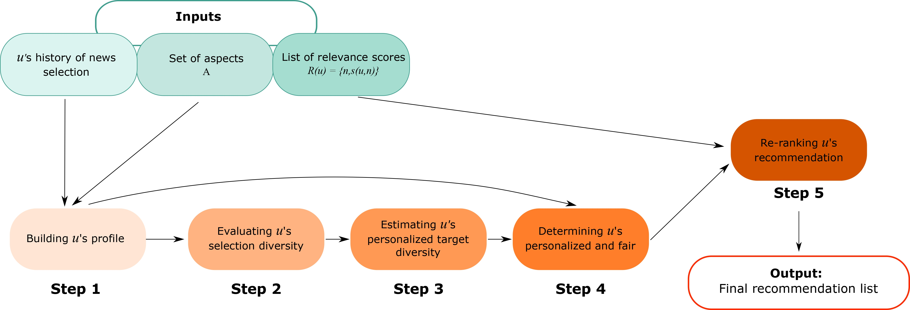

# ADF_framework

ADF is a novel news recommendation framework, intended to provide **fair**, **diverse**, and **accurate** recommendations. ADF is thus designed to promote users' awareness, through diversity, while not orienting users' main interests or opinions, through fairness. This repository contains the code to run the proposed framework on the MIND and Adressa datasets.

The different steps of ADF are the following:

Here is the organization of the code:
* **data**: contains all necessary data files for both Adressa and MIND datasets. 
* **reco_scores_baseline**: contains the list of relevance scores for all recommendation models (centroidVector, LSTUR, NAML, NPA, NRMS). Please note that news centroidVector was applied using the [ClayRS library](https://github.com/swapUniba/ClayRS), while deep-learning models were applied using the [NewsRecLib library](https://github.com/andreeaiana/newsreclib/tree/main). 
* **re_ranking**: contains the python files to apply the re-ranking approaches. Different ways to re-rank recommendations are included:
  * *Greeedy re-ranking (greedy.py)*: serve as baseline.
  * *ADF (ADF.py)*: proposed approach, fairness-constrained diversification, with personalization of the target diversity.
* **reco_scores_ADF**: contains the re-ranking list of recommendations when ADF is applied.
* **reco_scores_greedy**: contains the re-ranking list of recommendations when the greedy diversification is applied.
* **evaluation**: contains a notebook necessary to evaluate the outputs of the models (baselines and ADF).

*N.B: Please note that some files are too large to be uploaded on the GitHub repository* 

# License

This work is licensed under a [Creative Commons Attribution-NonCommercial-ShareAlike 4.0 International License](http://creativecommons.org/licenses/by-nc-sa/4.0/).

