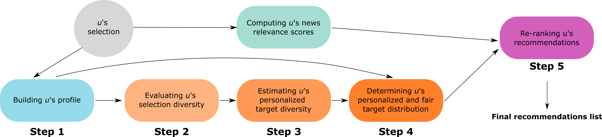

# ADF_framework

The different steps are the following:

Here is the organization of the code:
* **data**: contains all necessary data files
* **reco**: contains the notebook to compute relevance scores for each user. Please note that news was previously analyzed using the ClayRS library, and news representations are in the *news_codified_lda_128* folder. This folder contains two sub-folders:
  * *report_baseline_10k_cv_complete*: contains the relevance scores for each news, without any bounds. Missing news for a specific user means that the relevance score equals 0.
  * *report_baseline_10k_cv_k20*: contains the relevance scores of top-20 news for each user. This is a baseline. 
* **user_profile**: contains the notebook to build the user profile based on news topics and users' interactions (***Step 1***).
* **re_ranking**: contains the notebook to re-rank the recommendations. Different ways to re-rank recommendations are included (***Step 2, 3, 4 and 5***):
  * *Greeedy re-ranking*: serve as baseline.
  * *No personalization*: all users have the same target diversity
  * *ADF*: proposed approach, fairness-constrained diversification, with personalization of the target diversity.
* **evaluation**: contains all notebooks necessary to evaluate the outputs of the models (baselines and ADF), and to build figures.

# License

This work is licensed under a [Creative Commons Attribution-NonCommercial-ShareAlike 4.0 International License](http://creativecommons.org/licenses/by-nc-sa/4.0/).

